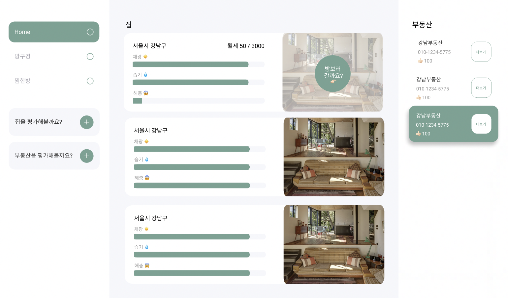

# 룸프리뷰
링크 : https://bit.ly/2YXL2Dk

## 무슨 서비스인가요? 
입주하고싶은 방에 대한 정보가 필요할때 사용합니다.
더이상 부동산의 거짓말에 속지마세요.
계약서에 싸인하기 전에는 되돌릴수 있습니다.
이 앱을 통해 이미 살아본 사람의 이야기를 듣고 결정합시다.

우리는 부동산을 통해 집을 보고 계약을 하곤 하는데, 이 과정에서
부동산측에서 집을 팔기위해 세입자에게 거짓말을 하는 경우가 있습니다.
그래서 우리는 계약서 싸인하고 나서야 이집에 문제점을 파악하는데요,
이미 계약서에 싸인하고나서 후회해봤자 되돌리수 있는것은 없습니다.
계약하기전에 이 앱을 통해 내가 들어가고자하는 집에 살아본 분들의 이야기를
듣고 결정하면 후회없는 결정을 할 수 있습니다.

## 어떤 정보를 얻을 수 있나요?
- 원하는 집의 계절별 가스비, 전기세, 채광, 습기, 벌레, 곰팡이, 집주인 간섭정도 등등
- 집 랭킹
- 부동산 랭킹(세입자들이 부동산의 신뢰도 또는 양심도를 직접 평가합니다)



## 실행방법
### 개발
```
npm run dev
```
### 빌드
```
npm run build
```
